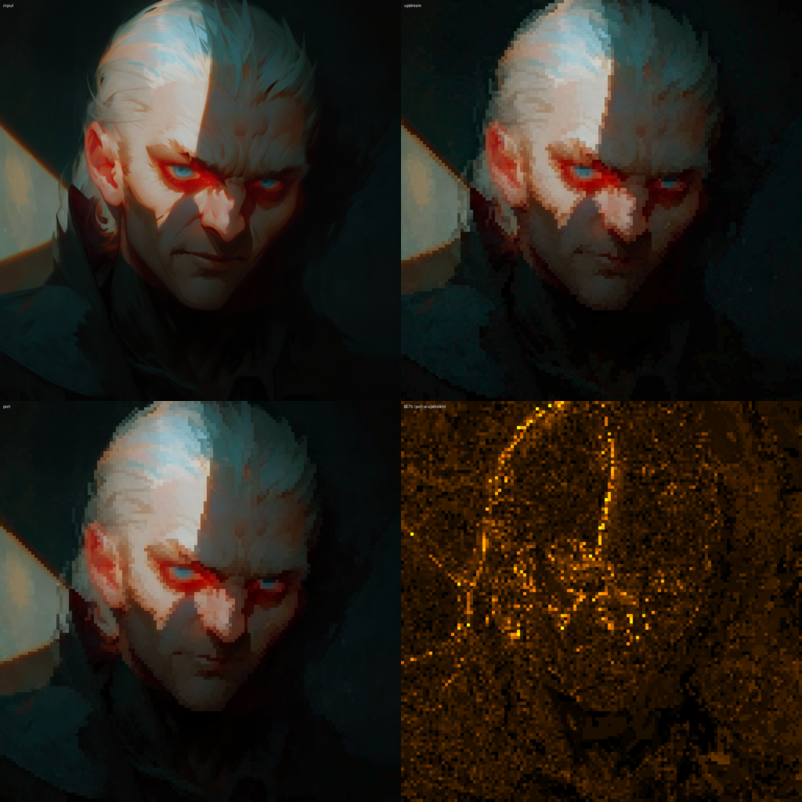
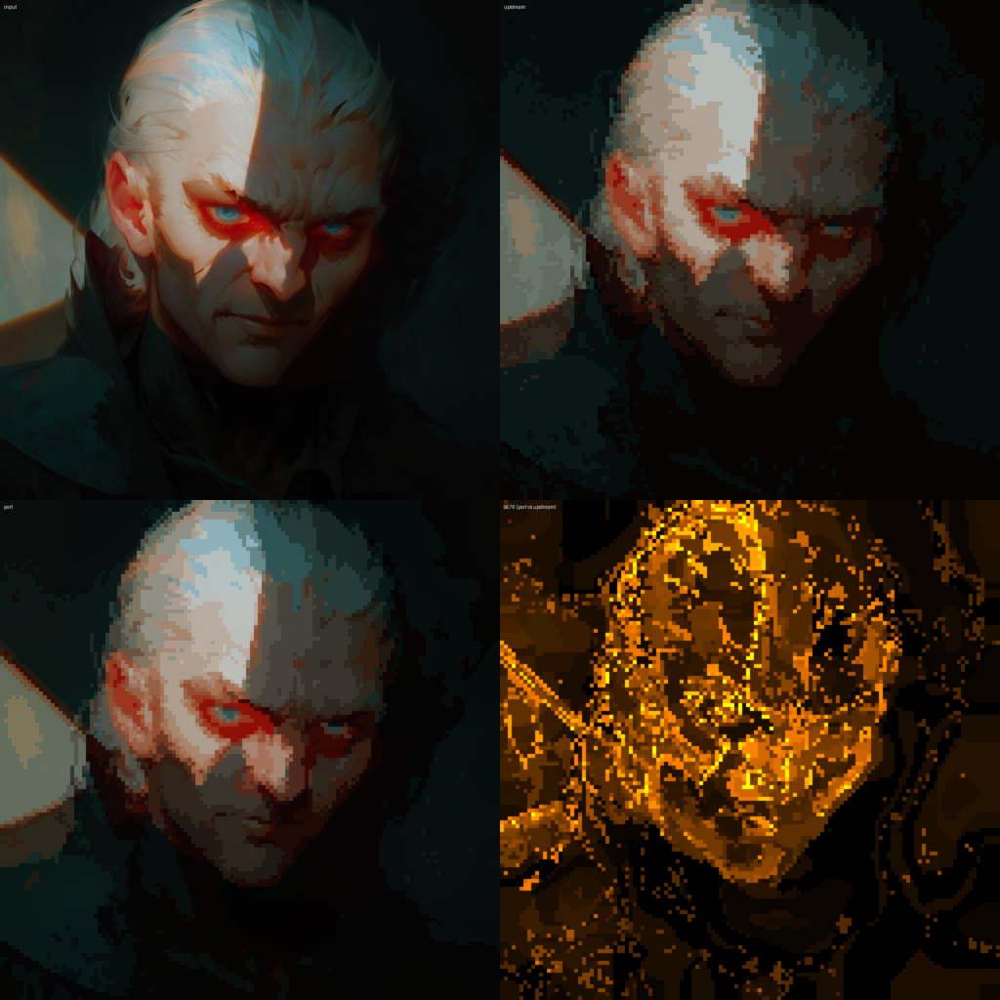

## What PixelOE actually does

PixelOE is a classical image-processing pipeline: outline-aware morphology, tile-wise pixel selection, pyramidal colour matching, and an optional k-means palette quantization at the end. It turns photographs and renders into something that looks like hand-authored pixel art, preserving silhouettes and saturation through aggressive size reductions where naive nearest-neighbour resampling at the same target resolution smears edges and washes the colour out. Upstream runs each stage on the GPU through `cv2`, `torch`, and `kornia`. None of those are options inside a Blender extension.

## I built the verification harness before porting any algorithm code

The first thing I wrote was a comparison rig. It runs upstream PixelOE in its own isolated virtualenv, with torch and cv2 still installed, and runs the port from the project's clean virtualenv. Both implementations get called on the same fixed test set, with the same RNG seed. The rig emits perceptual LAB-space colour deltas (ΔE76), per-channel L1 error in 0-255 byte units, and a 2x2 PNG panel for every test case with the original input top-left, upstream's output top-right, the port's output bottom-left, and a per-pixel ΔE76 heatmap of port versus upstream bottom-right.

The non-obvious choice was exposing each pipeline stage as an independently callable function, on both sides. The port wired stages in one at a time, and I could compare outline expansion alone against upstream's outline expansion before any of the rest of the pipeline existed. I could swap in my contrast-based downscale and check it in isolation against upstream's. End-to-end comparison came last, and mostly just confirmed what the per-stage rig had already established.

Building this took meaningful time up front, before any port code existed, and it is the single piece of infrastructure I would repeat without question on a port of any similar shape.

*Quantization disabled. The bottom-right diff is dim and tracks silhouettes. The algorithmic drift between port and upstream is real but low, concentrated where edges fall.*

## What per-stage comparison catches

A hidden no-op illustrates why. Upstream's outline-weight code resizes its intermediate result down by some stride and then back up to the original resolution. Read on its own, that round-trip looks like a smoothing pass. The per-stage rig made it obvious that nothing was actually happening. The previous step had produced an image of tile-constant blocks, where every output pixel within a tile is identical, and bilinear decimation of tile-constant data is the identity function. The port without the round-trip and the port with it produced the same output bytes. End-to-end comparison would have looked correct either way and the regression suite would never have flagged the redundancy.

The colour-matching stage gave me an algebraic equivalence I could actually trust. Upstream runs a wavelet cascade that, when you write out the loop, telescopes to a much simpler operation. Take the deep low-pass of the source, take the deep low-pass of the target, swap the first for the second, keep the source's high-frequency detail. That is amenable to a Burt-Adelson Gaussian pyramid (small blur plus 2x decimate, log-depth) instead of repeatedly evaluating ever-wider Gaussian kernels at full resolution. I would not have shipped that rewrite without something that could put a numerical bound on the equivalence on real images. The per-stage rig did exactly that in one run.

The most useful thing the harness ever told me was that my error metric was bundling two different effects. End-to-end ΔE76 between port and upstream sat around four to five on a 1k input, which sounds bad. Once I disabled colour quantization, the spread tightened sharply, from a range of 1.7-8.2 across the test set down to 0.8-5.5. The remainder was k-means picking different but equally optimal palettes for the same input, where the port uses k-means++ initialisation and upstream does best-of-four cv2 random-init runs. The two methods land on different cluster centroids of comparable distortion, and borderline pixels get assigned to neighbouring clusters, which produces a real RGB difference between outputs without producing a quality difference. Without splitting that out I would have spent a week chasing palette noise as though it were a bug in the algorithm port.

*Same input, with 32-colour quantization enabled. The bottom-right diff floods the whole face. None of that is algorithmic drift; it is two different k-means runs disagreeing on which cluster a borderline pixel belongs to. End-to-end ΔE alone could not tell me that. Decomposing the metric did.*

## What the harness made cheap

Once the verification rig was in place, optimisations that would otherwise have been risky became routine. The morphology code is a good example. Upstream applies a 3x3 erode or dilate filter N times in a Python loop, and the algebraic equivalent is a single morphological call with a (2N+1)-pixel-wide flat box footprint. scipy detects flat-rectangle footprints and runs them through its van Herk / Gil-Werman code path at constant cost per pixel regardless of window size. The harness confirmed bit-equivalence with the upstream loop, so the rewrite was a one-line drop-in.

The contrast-based downscale was a more aggressive change. Upstream slid a window across the full-resolution image, computing per-tile statistics that ultimately get decimated to the target grid. Reshaping the input into a non-overlapping tile grid and reducing along the tile axes directly produces the same statistics, and skips a full-resolution colour-space conversion that the eventual decimation throws away anyway. The per-stage diff against upstream came back within a perceptual unit, and visual comparison on the test set was indistinguishable.

Colour matching was the riskiest rewrite. Upstream runs the colour-match stage on the full-resolution image, before the downscale. The per-tile pixel selection preserves luminance ordering within each tile, and the deep low-pass that the colour-match swaps in is approximately constant within a small tile, which together mean that running the match after the downscale produces near-identical output. Doing it on a 256x256 small image runs roughly a hundred times faster than doing it on a 4k input. I would not have moved the stage without a per-stage perceptual delta to back the move, and the harness gave me one.

## The Blender layer had one interesting surprise

Most of the integration into Blender was mechanical. The Pixelize operator pulls pixels off the active image datablock, runs them through the port, and writes them back, with a small LUT to keep the sRGB boundary conversion fast. There is an N-panel sidebar for parameters and a packaging script that bundles scipy wheels for every supported (platform, Python ABI) pair into the addon zip, since Blender extensions cannot pip-install at runtime. None of that has anything interesting to say about porting algorithms.

The one surprise was a performance gap I would not have caught without the harness. The first version of the addon ran inside Blender noticeably slower than the same port code running in the uv-based test environment, about 150ms of extra wall-clock at default settings on a 4k input, which is meaningful when the whole operation takes around a second. I extended the per-stage harness to run inside Blender's bundled Python and compare timings stage-for-stage against the uv venv. The dominant difference was `Image.resize` in Pillow. Blender 5.1 ships Pillow 11.3; the project's uv venv was running 12.2, and the two versions of the same library differ by about a factor of two on the bilinear downscales the pipeline performs. I pinned the project venv's Pillow back to 11.3 to match Blender, so the harness numbers I had been treating as ground truth would actually match production. Finding the cause without per-stage timing inside the Blender harness would have been guesswork.

## The durable artifact

The port itself is not the durable artifact of this project. A future Claude Code session, given upstream and a clear specification, could rebuild it. The harness is what is durable, because it is what makes that rebuild trustworthy. In a world where implementation work is increasingly something a model can write, verification methodology is the part of the work that is hard to delegate.

This is also why three days worked. Most of day one was the harness, before any algorithm code existed. From that point on, every stage of the port was something I could describe, hand off, and verify against upstream within minutes. The bottleneck was the rate at which I could check work I had not done by hand. Take the harness away and the same pace becomes reckless.

The repository is at [capacap/blender-PixelOE](https://github.com/capacap/blender-PixelOE), and the harness lives in `tests/harness/`.
