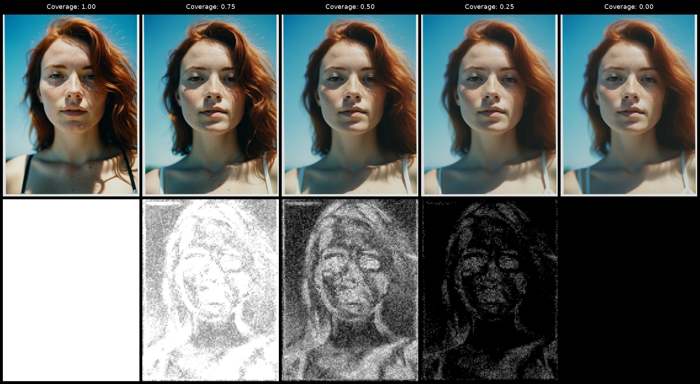

## Proving the mask

Selectivity sounds obvious as a feature, and the wrapping mechanics are simple. Two model forwards per step, one at the original sigma and one at a slightly reduced sigma, blended by a per-pixel mask. The hard part was deciding what the mask should actually be. If the mask doesn't track the parts of the image where extra detail genuinely helps, the whole apparatus is wasted compute on top of an existing technique that already works.

The first approach captured the latent at the first denoising step and used it as the mask for the rest of the run. The intuition was that early structure forecasts where late detail would land. In practice the first-step latent was too noisy to read as a region map, and freezing the mask at step zero left no way for it to track structure that emerged later. It also scaled badly across step counts. With three or four total steps the frozen mask was shaping a run that had barely started; with thirty steps the same mask was still being applied long after the prediction had moved on from where it was captured. There was no clean way to make a frozen first-step capture work at both ends of the schedule range users actually run.

The second approach, which won, computes the mask from the absolute difference between consecutive denoised predictions, smoothed across steps with an EMA. Where the model's prediction is still moving step to step, structure is still settling, and a detail boost helps. Where the prediction has stabilised, the wrapper leaves the normal sigma alone. The diff-plus-EMA also self-adjusts to step count. More steps means more updates feeding the smoothed mask, so it stays coherent across schedule lengths instead of going stale at long runs or under-developing at short ones.

Comparing the two candidates was only possible because the Debug node and its mask preview output were already in place. With them I could run the same prompt with the same seed under each candidate and see the mask actually being applied. The diff approach produced clearly-bounded regions concentrated on faces, textiles, and outlines. The first-latent approach produced something closer to a noise map.

The preview also showed where the useful signal was coming from. Early-step diffs were doing most of the work; late-step diffs degenerate into indistinct noise as the prediction stabilises. The EMA default sits at 0.9 so the early masks carry forward through the run instead of being averaged out by the noisier late-step contributions. The preview itself captures the mask at the final step, which is the dirtiest version of itself the run produces. Mid-run it's cleaner, before the late-step noise has fed in. The preview is therefore a final-step check, not a portrait of the mask at its sharpest.

*Coverage sweep at fixed strength, with the captured mask shown in the bottom row. At `c=0` no detail pass runs; at `c=1` the mask saturates and a single-pass fast path applies. The intermediate cells show the mask concentrating on face, freckles, and hair while the sky receives a substantially attenuated boost rather than full protection.*

## Cutting the user-facing surface

With the masking technique settled, the next thing to nail down was what users would actually touch. From the first day the plan was for two nodes. A production node with the minimum useful surface, and a Debug node with everything exposed plus the mask preview output. That split shaped the development style. The production node's defaults are the canonical configuration, and the Debug node is where I perturb constants in isolation to test those defaults against whatever new condition I am running. The split also disciplined what the wrapper was allowed to inherit from its lineage.

Detail Daemon ships a cosine schedule curve with several knobs for shaping it. Inheriting that surface unmodified would have meant pushing four or five additional sliders onto every user, each of which interacts with the others in ways that take a real session to develop intuition for. I tested it head-to-head against a flat-strength schedule with a narrow linear taper at the tail, and on the runs that mattered the cosine curve made no visible difference. It came out. The production surface stayed at two sliders, `strength` (the peak per-step fraction of sigma removed during the detail pass) and `coverage` (a single threshold-shift knob that subsumes what would otherwise be several mask-tuning parameters). The schedule's start and end fractions are internal constants, exposed on the Debug node for the rare investigation that needs them.

The Debug node ended up with the EMA, the mask clip percentile, the schedule start and end, and a `mask_override` switch that forces the mask to a constant value. The override was added as a sanity check on the blend math. Forcing the mask to all-ones at `coverage<1` should produce output identical to the `coverage=1` fast path; forcing it to all-zeros should match the baseline sampler with no wrapping. Cheap regression checks against a path that has no analytical right answer.

## CFG++, the bug that surfaced late

The wrapper looked finished at that point. Then it started misbehaving on CFG++ samplers (the `_cfg_pp` variants in ComfyUI). The detail effect at any given strength was massively exaggerated on `_cfg_pp` samplers compared to the equivalent non-CFG++ run. The first hypothesis was that the adjusted sigma was being computed wrong somewhere in the wrapper, perhaps a scale factor applied twice or the CFG scale leaking into the calculation. I walked the sigma math and it was correct.

The clue came from the `mask_override` switch that had been added as a sanity check. Comparing `mask_override=half` against `mask_override=ones`, naively `ones` should be the stronger setting. Every pixel takes the detail-sigma prediction and nothing else gets mixed in. `half` should be milder, an equal blend of the detail and normal predictions. On CFG++ samplers the inequality went the other way. `half` produced a noticeably more exaggerated result than `ones`, and the gap was bigger than any plausible reading of the strength parameter could explain. Whatever was wrong was happening inside the blend itself, not in the detail forward in isolation. That sent me into the CFG++ sampler implementation.

CFG++ samplers install a `post_cfg_function` hook that captures `uncond_denoised` into the sampler's closure on every model call, and use it as the noise direction term in their step formula. When the wrapper calls the model twice per step, both calls fire the hook and only the second call's value survives. The wrapper was leaving `uncond_denoised` captured at the detail-pass sigma while the sampler then plugged it into a formula that used the original sigma. The wrapper's blend also mixes `denoised` across two sigmas while uncond stays tied to one, which adds a cross-sigma term that amplifies effective strength. That term only exists when the blend actually runs. With `mask_override=ones` the blend output collapses to the detail prediction alone and the term doesn't fire; with `half` the two predictions mix at equal weight and the term hits maximum amplitude. The override had surfaced exactly what the math made invisible.

The fix is two-part. The two model calls were re-ordered so the wrapper ends on the original-sigma call, which leaves the surviving `uncond_denoised` at the sigma the sampler actually uses. And `strength` is attenuated by a factor of 0.15 when the wrapper detects a CFG++ sampler in the hook chain, to compensate for the residual cross-sigma term.

The 0.15 came out of a paired visual bench rather than a derivation. The reference run was Euler Ancestral (no CFG++) at strength 0.1, fixed prompt and seed. I then ran Euler Ancestral CFG++ at the same nominal strength on the same inputs and varied the attenuation factor until the CFG++ output read as roughly equivalent to the reference at mid-mask coverage. 0.15 was where they landed. It over-attenuates as the mask saturates toward 1, but the production node's `coverage=1` fast path runs only the detail forward and sidesteps the issue entirely, so users who want full-strength detail on a CFG++ sampler have a clean path that matches plain Detail Daemon's behaviour on the same samplers.

Better to ship a documented limitation with a documented workaround than a node that quietly produces wrong output on a popular family of samplers. The override that caught the bug existed because the Debug node was treated as a real development surface from the start, and not as something tacked on at the end.

## What shipped

The published node is a sampler wrapper with two production sliders. `strength` controls how hard the detail pass shifts sigma during the active part of the schedule. `coverage` shifts the mask threshold from "no detail at all" through a normal delta mask to a saturated all-ones mask. Both ends of the coverage range short-circuit to fast paths so users don't pay for two model forwards when one would do. CFG++ samplers are detected from their hook chain and get the strength attenuation automatically.

The Debug node sits alongside, exposing every internal constant and adding the `mask_override` switch. It pairs with a mask preview node that renders the captured mask as a regular IMAGE output, ready to be wired into a comparison grid like the one above.

What I didn't do is derive the CFG++ correction from first principles. The 0.15 attenuation works at the operating point I tested but it isn't math, just a visual match. A cleaner fix would align the captured `uncond_denoised` to the original sigma per step rather than compensating for the residual term with a constant. If I came back to this, that's where I'd start.

The experiment paid out. The repository is at [capacap/ComfyUI-Selective-Sigma-Detailer](https://github.com/capacap/ComfyUI-Selective-Sigma-Detailer).
